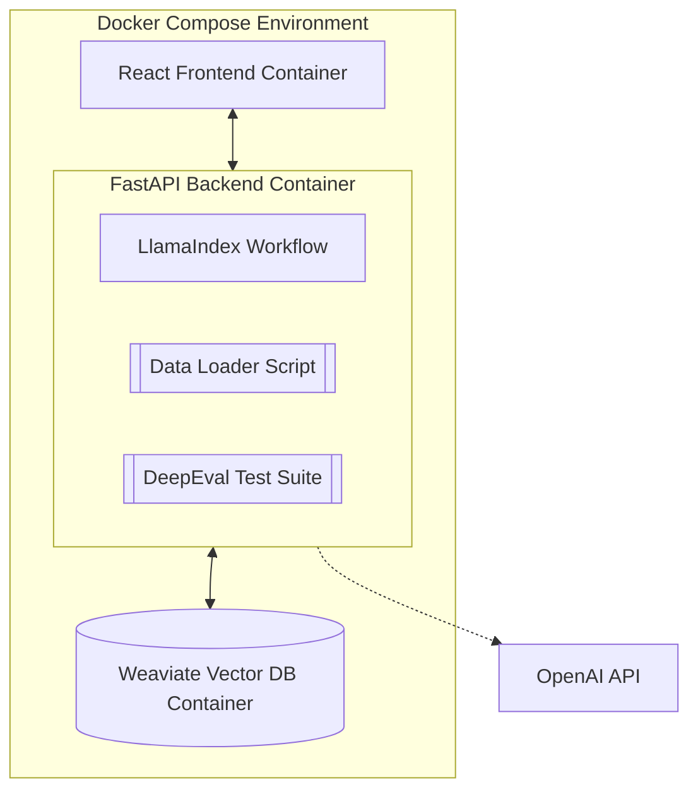
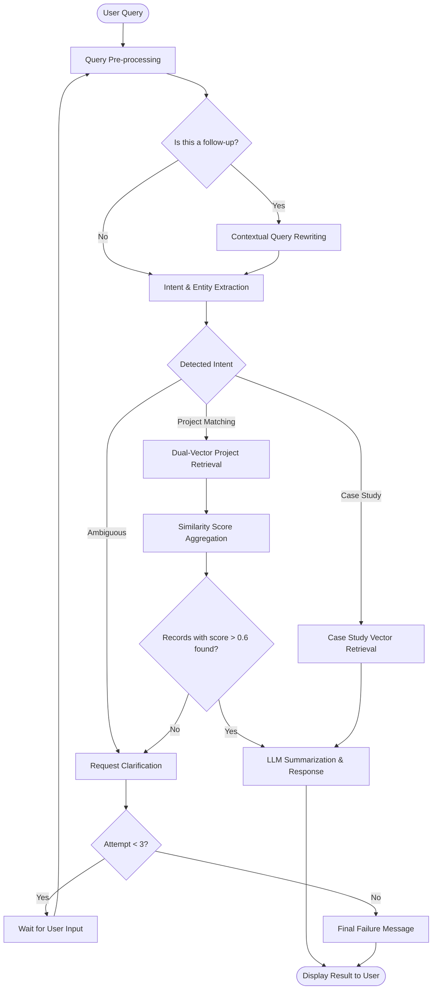

# AI Case Study & Project Matching Chatbot

An intelligent RAG-powered chatbot designed to retrieve detailed case study insights and match project requirements with historical data. This tool leverages **LlamaIndex Workflow**, **OpenAI**, and **Weaviate** to provide high-accuracy information retrieval.

---

## 🏗️ Architecture & System Design

The project is structured as a multi-container application managed by Docker Compose. The following diagram illustrates the relationship between the React frontend, the FastAPI backend (orchestrated by LlamaIndex), and the Weaviate vector database.



## 🔄 RAG Workflow  

The chatbot uses an event-driven workflow to handle user queries, manage conversation state, and ensure high-precision retrieval.



## Intent Classification

User queries are classified based on the **user’s underlying goal and the type of response they expect**, not simply on keywords, industries, or technologies mentioned.

As a rule of thumb:
- If the query can be answered with a **list of projects or capabilities**, it is a **Project**.
- If the query requires a **narrative explaining how a problem was solved and what impact it had**, it is a **Case Study**.
- If the expected response is **unclear**, the intent is **Ambiguous**.

---

### PROJECT_MATCHING — Technical Capability Validation

**Purpose**  
Used when the user is interested in **what was built** and **which technologies or services were used**. These queries focus on technical capability and delivery experience and can typically be answered with a structured list.

**Key Characteristics**
- Focus on **WHAT** was implemented
- Emphasis on technologies, architectures, and solutions
- No requirement for narrative, challenges, or outcomes

**Examples**

- **Show me examples of asset security systems using encrypted data channels and cloud monitoring for real-time tamper detection and asset status reporting.**  
  Requests examples of implementations involving specific technologies and solutions, focusing on what was built and the tools used.

- **Find projects using device gateways and data stream processing for real-time smart meter systems.**  
  Explicitly asks for projects and references concrete technologies, indicating technical capability validation.

- **I need a mobile payment integration solution that uses hybrid frameworks and push notifications for fraud detection and receipt generation.**  
  Specifies required technologies and features, implying a search for relevant projects or capabilities rather than a narrative.

---

### CASE_STUDY_RETRIEVAL — Narrative and Outcome Validation

**Purpose**  
Used when the user wants to understand **how a problem was solved**, **what challenges were encountered**, and **what outcomes were achieved**. These queries require contextual storytelling and business impact.

**Key Characteristics**
- Focus on **HOW** and **WHY**
- Emphasis on challenges, approach, and results
- Requires narrative context and impact

**Examples**

- **Tell me about a project where we optimized supply chain operations for a logistics client. What obstacles did we encounter, and what was the result in terms of efficiency and cost reduction?**  
  Requests a narrative describing challenges, approach, and measurable outcomes.

- **Can you explain how we improved customer Wi-Fi management for a retail client? What issues did we face, and how did the system improve customer access and service?**  
  Seeks a detailed explanation of the problem, solution, and resulting improvements.

- **Give me an overview of case studies that focus on how we've used data visualization and dashboards to improve business decision-making.**  
  Explicitly requests case studies and focuses on impact and improvement.

---

### AMBIGUOUS — Undefined or Unclear Intent

**Purpose**  
Used when a query mentions a topic, technology, or industry but does not clearly indicate whether the user expects a list of projects or a narrative case study.

**Key Characteristics**
- No clear directive or expected output
- Topic-only or broad experience statements
- Could reasonably be interpreted as either Project or Case Study

**Examples**

- **Tell me about our experience with microservices.**  
  Mentions a technology without specifying whether a list or a narrative is expected.

- **Cloud solutions in healthcare.**  
  References a domain and solution area without a clear instruction.

- **AI initiatives in the Finance and Healthcare sectors.**  
  Mentions initiatives and industries but does not specify whether examples or outcome-driven narratives are desired.

---

### Summary Rule

- **List of implementations or capabilities → PROJECT_MATCHING**
- **Narrative of challenges, approach, and outcomes → CASE_STUDY_RETRIEVAL**
- **Topic without instruction → AMBIGUOUS**


## 🛠️ Tech Stack

* **AI/RAG**: LlamaIndex (Workflows), OpenAI
* **Backend**: FastAPI, Poetry (Dependency Management)
* **Frontend**: React
* **Vector Database**: Weaviate
* **Evaluation**: DeepEval


## 🚀 Getting Started

### 1. Prerequisites
Ensure you have [Docker](https://www.docker.com/) and [Docker Compose](https://docs.docker.com/compose/) installed.

### 2. Environment Setup
Run the following command from the root folder of the project to create your local environment file:

For Mac / Linux / Git Bash / PowerShell:
```bash
cp backend/.env.example backend/.env
```
For Windows Command Prompt (CMD):
```bash
copy backend\.env.example backend\.env
```
Once created, set the **OPENAI_API_KEY** and **OPENAI_BASE_URL** under .env

### 3. Launch the application
Start the entire stack (Weaviate, API, and Frontend) using Docker Compose:

```bash
docker compose up 
```

Verify that the services are running:

Chatbot UI: http://localhost:3000 — Main user interface.

API Health & Docs: http://localhost:8000/docs — FastAPI Swagger documentation.

Database Ready: http://localhost:8080/v1/.well-known/ready — Should return a 200 OK status.

### 4. Data Ingestion
Once the containers are healthy, the synthetic data must be loaded into Weaviate. Run the following command from the root folder of the project:
```bash
docker compose exec backend poetry run load-data
```

Data sources: _backend/data/case_studies.json_ and _backend/data/projects.json_.

## 📊 Evaluation

To ensure the quality of the chatbot responses, DeepEval is used to run "LLM-as-a-judge" audits across four core scenarios. Each scenario is tested against a specific set of metrics by executing the workflow against a **Golden Dataset** and scoring the results.

### 1. Multi-Scenario Testing
The evaluation suite categorizes tests into three distinct scenarios, applying specialized metrics to each:

* **Case Study Summarization**
* **Project Matching**
* **Ambiguous Intent Clarification Logic**
* **No results Clarification Logic**

### 2. Key Metrics

| Metric | Goal | Description |
| :--- | :--- | :--- |
| **Faithfulness** | Anti-Hallucination | Ensures the answer is derived *only* from retrieved Weaviate records. |
| **Intent Accuracy** | Classification | Measures if the system correctly identified the user's intent (project matching vs. case study retrieval). |
| **Attribute Coverage** | Completeness | Validates that key entities from the retrieved records are captured in the response. |
| **Score Threshold** | Quality Gate | Validates that retrieved projects meet the minimum $0.6$ similarity score. |
| **Latency** | Performance | Ensures the end-to-end RAG workflow completes within a 40-second window. |
| **Clarification** | Clarification | Validates that the system correctly handles queires where clarification is needed. |


### 3. Running Evaluations
The evaluation runs as an ephemeral task within the backend container to ensure it has direct access to the Weaviate network and it can be triggered by executing the following command from the root folder of the project:

```bash
docker compose exec backend poetry run run-eval
```
The script will output a Final Summary Report with a pass rate percentage and average scores for each metric per scenario.


## 📂 Project Structure

```text
├── backend
│   ├── app                     # FastAPI Application Source
│   │   ├── api/                # Route definitions and API endpoints
│   │   ├── core/               # Global configuration, settings, and LLM prompts
│   │   ├── models/             # Pydantic schemas and data models
│   │   ├── repositories/       # Data Access Layer (Weaviate-specific logic)
│   │   ├── services/           # Core Business Logic & LlamaIndex Workflow
│   │   ├── dependencies.py     # Dependency injection (Services, Repos)
│   │   └── main.py             # Application entry point
│   ├── .env.example            # Template for required environment variables
│   ├── data/                   # Knowledge Base (case_studies.json, projects.json)
│   ├── evaluation/             # DeepEval suite, custom metrics, and golden dataset
│   └── scripts/                # Data ingestion and synthetic data generation
├── frontend/                   # React application source code
├── docker-compose.yml          # Multi-container orchestration config
```

